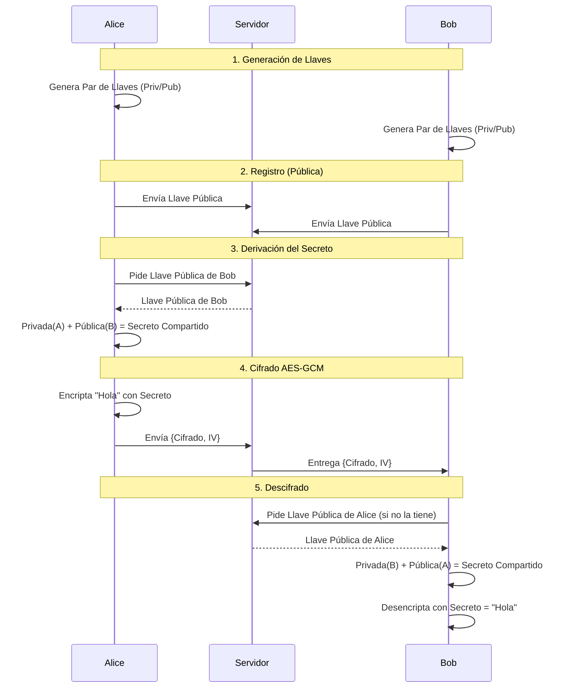

# Explicación del Cifrado de Punto a Punto (E2EE)

La aplicación utiliza un sistema híbrido de cifrado para garantizar que solo el remitente y el destinatario puedan leer los mensajes. Nadie más, ni siquiera el servidor, tiene acceso al contenido de los mensajes.

El proceso se divide en tres etapas principales: Generación de Llaves, Intercambio y Derivación, y Cifrado Simétrico.

## 1. Generación de Llaves (ECDH)
Cuando un usuario ingresa a la aplicación (`KeySetup.jsx`), se genera un par de llaves criptográficas en su navegador usando la API **Web Crypto**:
- **Llave Privada**: Se mantiene segura en la memoria del navegador. **Nunca** se comparte ni se envía al servidor.
- **Llave Pública**: Se envía al servidor para que otros usuarios puedan "encontrarte".

Algoritmo usado: **ECDH** (Elliptic Curve Diffie-Hellman) con la curva **P-256**.

## 2. Intercambio y Derivación del Secreto (Shared Secret)
Para que dos usuarios (Alice y Bob) puedan comunicarse de forma segura, ambos deben acordar una "contraseña" secreta sin enviársela directamente. Esto se logra mediante **ECDH**:

1.  **Alice** toma su *Llave Privada* y la *Llave Pública* de Bob.
2.  **Bob** toma su *Llave Privada* y la *Llave Pública* de Alice.
3.  Ambos ejecutan una función matemática que da como resultado **exactamente el mismo secreto** (`Shared Secret`).

Este secreto se convierte en una llave para encriptar mensajes (AES Key).

## 3. Cifrado y Descifrado (AES-GCM)
Una vez que se tiene el secreto compartido, se usa para cifrar los mensajes reales.

### Encriptación (Remitente)
Cuando envías un mensaje:
1.  Se genera un **IV** (Vector de Inicialización) aleatorio único para ese mensaje.
2.  Se usa el algoritmo **AES-GCM** (Advanced Encryption Standard - Galois/Counter Mode) con el *Secreto Compartido* y el *IV*.
3.  El resultado es el texto cifrado (`cipherText`).
4.  Se envía al servidor: `{ sender, recipient, cipherText, iv }`.

### Desencriptación (Destinatario)
Cuando recibes un mensaje:
1.  El cliente busca el *Secreto Compartido* asociado al remitente.
    - *Nota: Si no lo tiene (ej. por refrescar página), descarga la llave pública del remitente y regenera el secreto.*
2.  Usa **AES-GCM** con el *Secreto Compartido* y el *IV* que vino con el mensaje para "abrir" el `cipherText`.
3.  El resultado es el texto original legible.

## Resumen del Flujo

